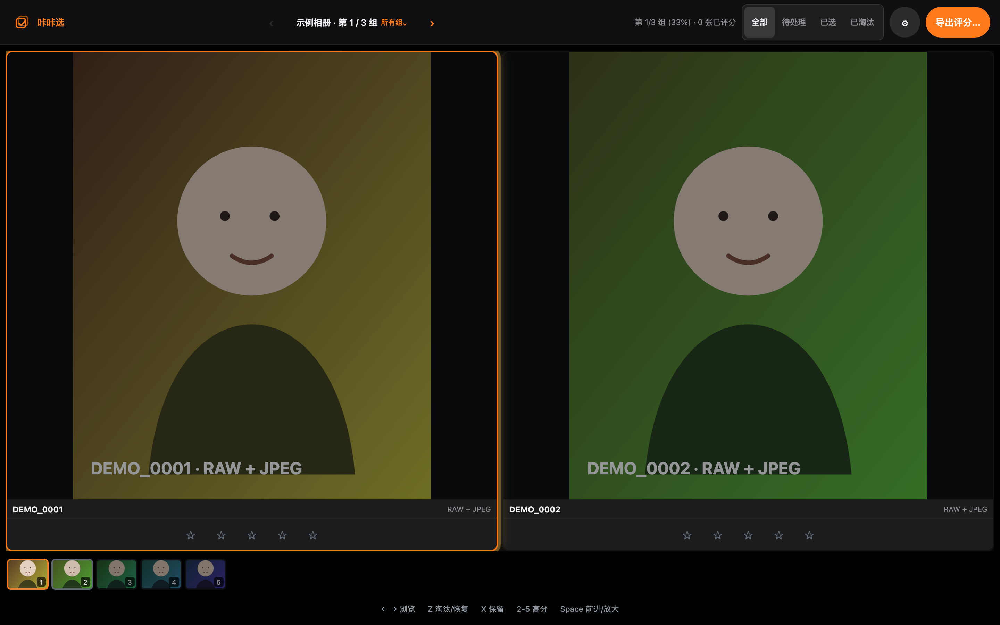
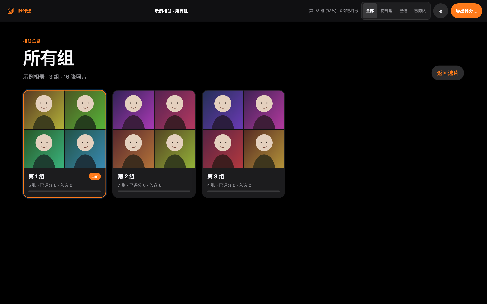

# KakaPick


**Shoot more. Cull faster.**

KakaPick is a local-first photo culling app for photographers. It groups bursts and similar shots for side-by-side comparison, keyboard rating, and safe export—without uploading your photos.

[Website](https://DongZhouGu.github.io/KakaPick/) · [Download for macOS](https://github.com/DongZhouGu/KakaPick/releases/latest) · [简体中文](README.md)

> Early public release · Apple Silicon · macOS 13+ · MIT



## Make the decisions, skip the busywork

A burst can contain dozens of nearly identical frames. KakaPick handles the repetitive organization so you can focus on sharpness, expression, and timing. It does not claim to choose the “best” photo or replace your judgment.

## From folder to final selects

1. **Open a folder.** Same-directory RAW, JPEG, and XMP files with matching normalized names become one photo unit.
2. **Let KakaPick organize.** Capture time, camera information, and image similarity help group bursts and related frames.
3. **Compare clearly.** Review 1–5 photos side by side with synchronized zoom and pan, a filmstrip, and a full-group overview.
4. **Cull continuously.** Keep, reject, or apply a 0–5 star rating from the keyboard; split, merge, and undo when a group needs adjustment.
5. **Export safely.** Write Lightroom-compatible ratings or copy selected RAW, JPEG, and XMP files into a separate folder.

KakaPick suits event, portrait, wedding, travel, and other burst-heavy photography.



## Highlights

- **Local-first:** photos, thumbnails, ratings, and exports stay on your Mac; there is no upload, account, or cloud sync.
- **Fast visual comparison:** adaptive 1–5-up layouts, synchronized detail inspection, and keyboard-first navigation.
- **Useful, restrained assistance:** local image metrics can flag blur, overexposure, and underexposure without pretending to make aesthetic decisions.
- **Lightroom-compatible workflow:** ratings can be written to compatible metadata without modifying the Lightroom catalog database.
- **Safe source handling:** proprietary RAW bytes are not modified; export writes use preflight checks and transactional file operations.
- **Fast resume:** saved sessions and cached analysis avoid repeated work when an album has not changed.

## Install on macOS

Download the current build from [GitHub Releases](https://github.com/DongZhouGu/KakaPick/releases/latest), open the DMG, and drag KakaPick into Applications.

Current public builds target Apple Silicon Macs running macOS 13 or newer. They use ad-hoc signing and are not notarized by Apple, so macOS may block the first launch. If you trust the download, right-click KakaPick in Finder and choose **Open**. Only install builds from a source you trust.

## Quick start

1. Choose a photo folder or reopen a recent album.
2. Compare each group and rate or reject its frames.
3. Export ratings as Lightroom-compatible metadata, or copy selected source files to a separate “selects” folder.

| Input | Action |
| --- | --- |
| `1`–`5` | Apply a star rating |
| `X` | Keep |
| `Z` | Reject or restore |
| `[` / `]` | Previous / next group |
| `S` | Split the current group |
| `M` | Merge with the next group |
| `⌘Z` | Undo |
| `Space` | Temporarily zoom |
| `Ctrl` + wheel | Synchronized zoom |

Shortcuts and the number of photos shown at once can be adjusted in Settings.

## Formats and export

Supported files include JPG/JPEG, ARW, CR2, CR3, NEF, RAF, RW2, ORF, and DNG. When only a RAW file is available, KakaPick attempts to use its embedded preview.

Metadata export writes Lightroom-compatible ratings to the appropriate metadata target; it does not edit the Lightroom catalog. Copy export places selected source files and their related files in a separate destination.

## Privacy and safety

- The local HTTP service binds only to IPv4 loopback and validates Host, Origin, and a per-process token.
- Public API responses, the interface, and export reports do not reveal absolute photo paths.
- The Electron renderer uses sandboxing and context isolation with Node integration disabled.
- Session data is stored under `~/Library/Application Support/BurstPick/`; thumbnails are cached under `~/Library/Caches/BurstPick/`. These internal legacy names remain for data compatibility.

Read the [architecture](docs/architecture.md) and [security policy](SECURITY.md) for the complete boundary. Report vulnerabilities through GitHub private vulnerability reporting, not a public exploit report.

## Build and contribute

Source builds require macOS 13+, Node.js 20.3+, and pnpm 11.7.0.

```bash
pnpm install
pnpm dev
```

Create a standalone app or DMG with `pnpm desktop:pack` or `pnpm desktop:dist`. Packaged builds include Electron, Node.js, Sharp, and ExifTool.

Bug reports, focused fixes, tests, and documentation improvements are welcome. Start with [CONTRIBUTING.md](CONTRIBUTING.md); the broader documentation index is in [docs/README.md](docs/README.md).

## Current limitations

KakaPick is pre-release software. Public builds currently support Apple Silicon and macOS 13+ only, and are ad-hoc signed rather than notarized. KakaPick does not provide cloud sync, collaboration, photo editing, RAW development, or automatic final aesthetic selection.

## License

[MIT](LICENSE) © 2026 KakaPick contributors
